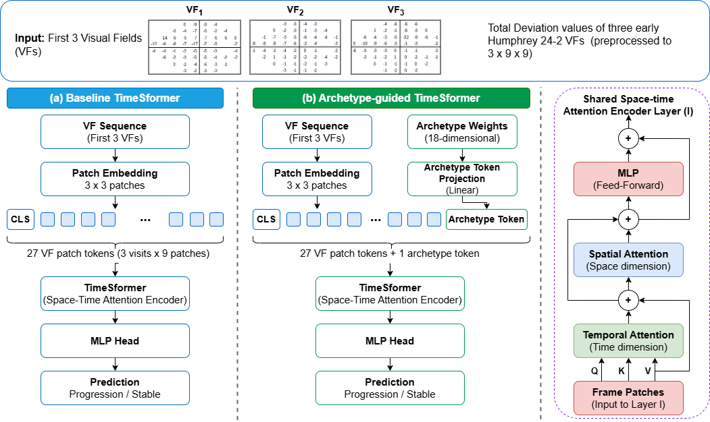

# 📄 ArTiSan: Archetype-Aware TimeSformer for Fast Glaucoma Progression
Official repository for the paper that was presented in 13th OMIA workshop (2026).

Authors: Viska Mutiawani, Patrick Avelino Kodrat, Ghulam Mubashar Hassan, Naeha Sharif 
> Presented in *International Workshop on Ophthalmic Medical Image Analysis*, 2026.  
> [Link to paper](paper/27_final.pdf)]

---

## 🗂️ Repository Structure

```plaintext
├── code/                # Source code for experiments
├── dataset/             # Dataset or links/instructions to access data
├── images/              # Figures and visualization results
├── results/             # Output files, metrics, logs
├── notebooks/           # Jupyter notebooks for demos or analysis
├── LICENSE
├── requirements.txt
└── README.md
````

---

## 🚀 Getting Started

### 1. Clone the repository

```bash
git clone https://github.com/your-username/your-repo-name.git
cd your-repo-name
```

### 2. Set up the environment

We recommend using a virtual environment:

```bash
python -m vfenv vfenv
source vfenv/bin/activate      # On Windows: vfenv\Scripts\activate
pip install -r requirements.txt
```

### 3. Run a sample experiment

Open and run the demo notebook:

```bash
jupyter notebook notebooks/demo.ipynb
```

---

## 📊 Results and Visualizations

You can find generated figures and outputs in the `images/` and `results/` folders.


---

## 📁 Dataset

* **Dataset Name**: UWHVF
* **Source**: [Download Link](https://github.com/uw-biomedical-ml/uwhvf)
* **License**: BSD-3

Place the dataset in the following structure:

```plaintext
dataset/
└── dataset_name/

```

---

## 📦 Framework

### Methodology to find generalized VF patterns



---

## 📜 Citation

If you use this code or our paper, please cite: 

```bibtex

```

## ⭐ Acknowledgements
We use the Archetypal Analysis code provided in [this site](https://researchdata.edu.au/archetypal-analysis-package/1424520) which is the same as archetypes library in Python.
The Transformer code was adapted from [baseline work by Tian](https://doi.org/10.1007/978-3-031-44013-7_7). 

---

## 🤝 Q & A
You can check the contact if there is any question.

---

## 📄 License

This project is licensed under the [MIT License](LICENSE).

---

## 📬 Contact

* 📧 Email: [uwa email](mailto:viska.mutiawani@research.uwa.edu.au)
* 🌐 Website: 
* 🧑 GitHub: 

---


